# Komunikasi Data dan Jaringan Komputer — Modul 3

## 1. Konfigurasi IP Jaringan 
**Goal:** Menetapkan konfigurasi IP statis untuk semua node dalam topologi dan mengkonfigurasi Network Address Translation (NAT) pada router utama (`Durin`). Pengaturan ini penting agar setiap node dapat terhubung ke internet untuk instalasi paket awal, sesuai dengan persyaratan pengerjaan.

## 1.1 Konfigurasi
Pada node **router** (DURIN):
```
auto eth0
iface eth0 inet dhcp
	up iptables -t nat -A POSTROUTING -o eth0 -j MASQUERADE -s 10.72.0.0/16

auto eth1
iface eth1 inet static
	address 10.72.1.1
	netmask 255.255.255.0

auto eth2
iface eth2 inet static
	address 10.72.2.1
	netmask 255.255.255.0

auto eth3
iface eth3 inet static
	address 10.72.3.1
	netmask 255.255.255.0

auto eth4
iface eth4 inet static
	address 10.72.4.1
	netmask 255.255.255.0

auto eth5
iface eth5 inet static
	address 10.72.5.1
	netmask 255.255.255.0
```

Pada node **statis** (untuk pada awalnya semua adalah node statis):
```
auto eth0
iface eth0 inet dhcp
        up iptables -t nat -A POSTROUTING -o eth0 -j MASQUERADE -s 10.72.0.0/16

auto eth1
iface eth1 inet static
        address 10.72.1.1
        netmask 255.255.255.0

auto eth2
iface eth2 inet static
        address 10.72.2.1
        netmask 255.255.255.0

auto eth3
iface eth3 inet static
        address 10.72.3.1
        netmask 255.255.255.0

auto eth4
iface eth4 inet static
        address 10.72.4.1
        netmask 255.255.255.0

auto eth5
iface eth5 inet static
        address 10.72.5.1
        netmask 255.255.255.0

Elendil:
auto eth0
iface eth0 inet static
        address 10.72.1.2
        netmask 255.255.255.0
        gateway 10.72.1.1
        up echo nameserver 192.168.122.1 > /etc/resolv.conf

Isildur:
auto eth0
iface eth0 inet static
        address 10.72.1.3
        netmask 255.255.255.0
        gateway 10.72.1.1
        up echo nameserver 192.168.122.1 > /etc/resolv.conf
Anarion:
auto eth0
iface eth0 inet static
        address 10.72.1.4
        netmask 255.255.255.0
        gateway 10.72.1.1
        up echo nameserver 192.168.122.1 > /etc/resolv.conf

Miriel:
auto eth0
iface eth0 inet static
        address 10.72.1.5
        netmask 255.255.255.0
        gateway 10.72.1.1
        up echo nameserver 192.168.122.1 > /etc/resolv.conf

Amandil:
auto eth0
iface eth0 inet static
        address 10.72.1.6
        netmask 255.255.255.0
        gateway 10.72.1.1
        up echo nameserver 192.168.122.1 > /etc/resolv.conf

Elros:
auto eth0
iface eth0 inet static
        address 10.72.1.7
        netmask 255.255.255.0
        gateway 10.72.1.1
        up echo nameserver 192.168.122.1 > /etc/resolv.conf

Khamul:
auto eth0
iface eth0 inet static
        address 10.72.2.2
        netmask 255.255.255.0
        gateway 10.72.2.1
        up echo nameserver 192.168.122.1 > /etc/resolv.conf

Erendis:
auto eth0
iface eth0 inet static
        address 10.72.2.3
        netmask 255.255.255.0
        gateway 10.72.2.1
        up echo nameserver 192.168.122.1 > /etc/resolv.conf

Amdir:
auto eth0
iface eth0 inet static
        address 10.72.2.4
        netmask 255.255.255.0
        gateway 10.72.2.1
        up echo nameserver 192.168.122.1 > /etc/resolv.conf

Aldarion:
auto eth0
iface eth0 inet static
        address 10.72.3.2
        netmask 255.255.255.0
        gateway 10.72.3.1
        up echo nameserver 192.168.122.1 > /etc/resolv.conf

Palantir:
auto eth0
iface eth0 inet static
        address 10.72.3.4
        netmask 255.255.255.0
        gateway 10.72.3.1
        up echo nameserver 192.168.122.1 > /etc/resolv.conf

Narvi:
auto eth0
iface eth0 inet static
        address 10.72.3.5
        netmask 255.255.255.0
        gateway 10.72.3.1
        up echo nameserver 192.168.122.1 > /etc/resolv.conf

Pharazon:
auto eth0
iface eth0 inet static
        address 10.72.4.2
        netmask 255.255.255.0
        gateway 10.72.4.1
        up echo nameserver 192.168.122.1 > /etc/resolv.conf

Celebrimbor:
auto eth0
iface eth0 inet static
        address 10.72.4.3
        netmask 255.255.255.0
        gateway 10.72.4.1
        up echo nameserver 192.168.122.1 > /etc/resolv.conf

Gilgalad:
auto eth0
iface eth0 inet static
        address 10.72.4.4
        netmask 255.255.255.0
        gateway 10.72.4.1
        up echo nameserver 192.168.122.1 > /etc/resolv.conf

Oropher:
auto eth0
iface eth0 inet static
        address 10.72.4.5
        netmask 255.255.255.0
        gateway 10.72.4.1
        up echo nameserver 192.168.122.1 > /etc/resolv.conf

Celeborn:
auto eth0
iface eth0 inet static
        address 10.72.4.6
        netmask 255.255.255.0
        gateway 10.72.4.1
        up echo nameserver 192.168.122.1 > /etc/resolv.conf

Galadriel:
auto eth0
iface eth0 inet static
        address 10.72.4.7
        netmask 255.255.255.0
        gateway 10.72.4.1
        up echo nameserver 192.168.122.1 > /etc/resolv.conf

Minastir:
auto eth0
iface eth0 inet static
        address 10.72.5.2
        netmask 255.255.255.0
        gateway 10.72.5.1
        up echo nameserver 192.168.122.1 > /etc/resolv.conf
```

## 1.2 Uji Konfigurasi

Setelah menjalankan tiap _network configuration_, keberhasilan dapat diuji dengan melakukan `ping google.com` dari setiap node untuk memverifikasi bahwa konfigurasi NAT pada **Durin** dan resolver awal pada setiap node berhasil. 

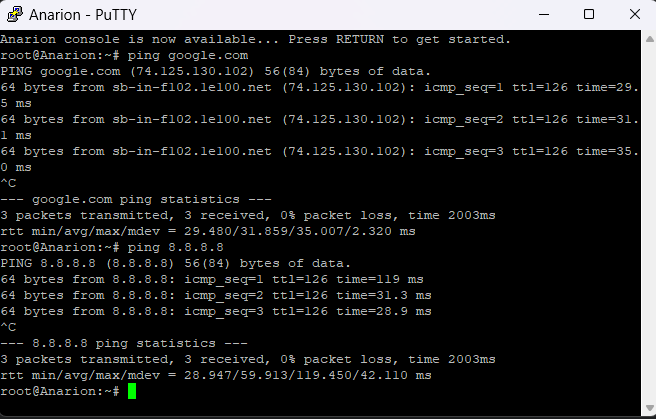
# 2. DHCP Server & Relay
**Goal:** Mengonfigurasi `Aldarion` sebagai DHCP Server utama untuk mengalokasikan "tanah" (IP Address) secara dinamis kepada para _client_ . Ini mencakup penetapan rentang spesifik untuk Keluarga Manusia dan Peri, serta alamat tetap untuk `Khamul`. `Durin` juga dikonfigurasi sebagai DHCP Relay untuk memastikan dekrit ini tersampaikan ke semua wilayah. Pengerjaan dari soal ini juga mencakup implementasi _lease time_ (Soal 6).

## 2.1 Konfigurasi DHCP Server
Node **Aldarion** (`10.72.3.2`) diinstal `isc-dhcp-server` dan dikonfigurasi untuk mendengarkan pada `eth0`.

```
echo "install isc dhcp server"
apt-get update
apt-get install isc-dhcp-server -y

echo "configure dhcp server listen eth0"
cat > /etc/default/isc-dhcp-server << EOF
INTERFACESv4="eth0"
EOF
```

Selanjutnya, file `/etc/dhcp/dhcpd.conf` dikonfigurasi untuk menetapkan _scope_ DHCP:

- `option domain-name-servers` diatur ke `10.72.5.2` (Minastir), sesuai dengan Soal 3 .
- **Subnet 10.72.1.0** (Keluarga Manusia) dikonfigurasi dengan rentang dan _lease time_ 18000 detik (5 jam), dengan maks 36000 detik (10 jam) .
- **Subnet 10.72.4.0** (Keluarga Peri) dikonfigurasi dengan rentang .
- **Host Khamul** diberikan alamat IP tetap `10.72.3.95` .

```
echo "main configuration dhcp"
cat > /etc/dhcp/dhcpd.conf << EOF
option domain-name-servers 10.72.5.2;
subnet 10.72.1.0 netmask 255.255.255.0{
        option routers 10.72.1.1;
        option broadcast-address 10.72.1.255;
        range 10.72.1.6 10.72.1.34;
        range 10.72.1.68 10.72.1.94;
        default-lease-time 1800;
        max-lease-time 3600;
}

subnet 10.72.2.0 netmask 255.255.255.0 {
        option routers 10.72.2.1;
        option broadcast-address 10.72.2.255;
}

subnet 10.72.3.0 netmask 255.255.255.0 {
        option routers 10.72.3.1;
        option broadcast-address 10.72.3.255;
}

subnet 10.72.4.0 netmask 255.255.255.0 {
        option routers 10.72.4.1;
        option broadcast-address 10.72.4.255;
        range 10.72.4.35 10.72.4.67;
        range 10.72.4.96 10.72.4.121;
        default-lease-time 600;
        max-lease-time 3600;
}

subnet 10.72.5.0 netmask 255.255.255.0 {
        option routers 10.72.5.1;
        option broadcast-address 10.72.5.255;
}

host Khamul {
        hardware ethernet 02:42:97:af:82:00;
        fixed-address 10.72.3.95;
}
EOF

echo "restart dhcp server"
service isc-dhcp-server restart
```
## 2.2 Konfigurasi DHCP Relay 

Node **Durin** diinstal `isc-dhcp-relay` untuk meneruskan permintaan DHCP dari berbagai subnet ke server **Aldarion** (`10.72.3.2`) .

- Relay dikonfigurasi untuk mendengarkan pada `eth1` (Subnet Manusia), `eth3` (Subnet Aldarion/Khamul), dan `eth4` (Subnet Peri).
- IP forwarding diaktifkan pada kernel.

```
echo "install isc dhcp relay"
apt-get update
apt-get install isc-dhcp-relay -y

echo "configure dhcp relay"
cat > /etc/default/isc-dhcp-relay << EOF
SERVERS="10.72.3.2"
INTERFACES="eth1 eth3 eth4"
OPTIONS=""
EOF

echo "activate forwarding"
cat >> /etc/sysctl.conf << EOF
net.ipv4.ip_forward=1
EOF
sysctl -p

echo "restart dhcp relay"
service isc-dhcp-relay restart
```

## 2.3 Uji Konfigurasi

Pengujian dilakukan dari _client dynamic_ seperti **Amandil** (Keluarga Manusia) dan **Gilgalad** (Keluarga Peri).

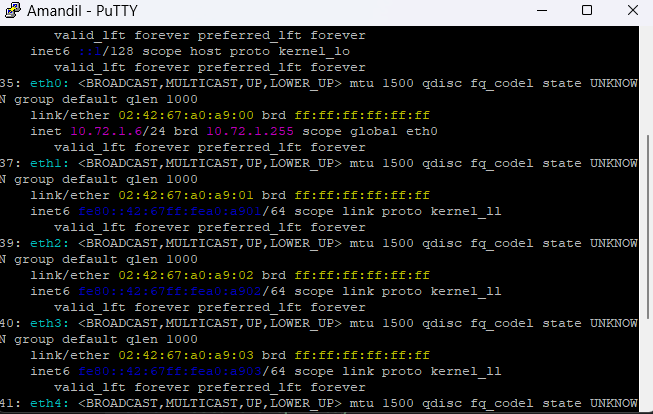
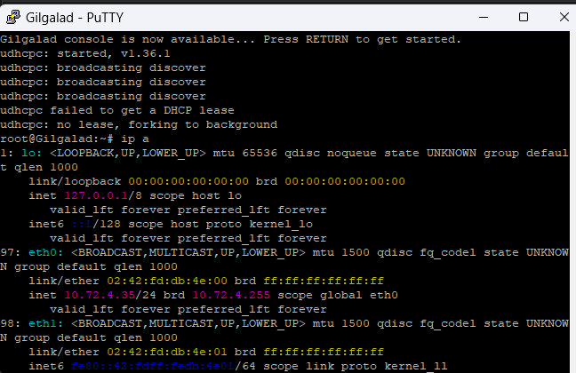
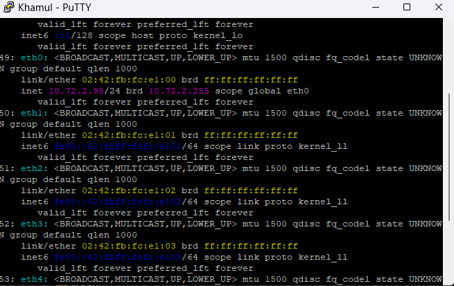

# 3. DNS Forwarder

**Goal**: Mendirikan "menara pengawas" **Minastir** untuk mengontrol semua arus informasi dari Arda ke dunia luar (Valinor/Internet) . Semua node di dalam jaringan (kecuali `Durin`) diwajibkan melakukan kueri DNS melalui `Minastir`.

## 3.1 Konfigurasi 

Node **Minastir** (`10.72.5.1`) dikonfigurasi sebagai _DNS Forwarder_. Ini dicapai dengan menginstal `bind9` dan memodifikasi file `named.conf.options` agar hanya meneruskan (_forward only_) semua kueri yang tidak dapat diselesaikan secara lokal ke DNS internet (`192.168.122.1`).

```
echo "install bind9"
apt-get update
apt-get install bind9 -y

echo "configure bind9"
cat > /etc/bind/named.conf.options << EOF
options {
    directory "/var/cache/bind";
    forwarders {
	    10.72.2.3; # soal berikutnya
	    10.72.2.4; # soal berikutnya
        192.168.122.1;
    };
    forward only;
    allow-query { any; };
    dnssec-validation no;
    auth-nxdomain no;
    listen-on-v6 { any; };
};
EOF

echo "bind9 service restart" 
service named restart
```

## 3.2 Uji Konfigurasi

Untuk mengarahkan semua node agar menggunakan **Minastir** sebagai resolver utama:

1. **Node Dinamis (via DHCP):** Konfigurasi pada **Aldarion** (`soal2_3_6_aldarion.sh`) telah menyertakan `option domain-name-servers 10.72.5.2;`. Klien seperti `Amandil` dan `Gilgalad` secara otomatis akan menggunakan `Minastir` setelah mendapatkan _lease_ DHCP.


2. **Node Statis:** Node seperti `Miriel` dan `Celebrimbor` harus mengubah file `/etc/resolv.conf` mereka secara manual dari `192.168.122.1` menjadi `nameserver 10.72.5.2`.

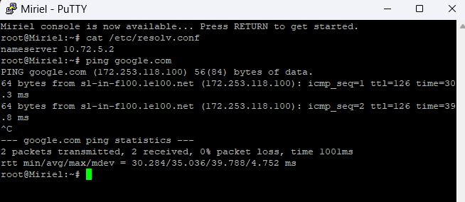

## 4. DNS Master dan Resolver

**Goal**: Mengkonfigurasi **Erendis** sebagai DNS Master untuk domain internal `k17.com` (asumsi `<xxxx>` adalah `k17`). Konfigurasi ini mencakup penetapan _record_ untuk semua node penting, penunjukan **Amdir** sebagai _slave_, pembuatan alias `www`, _reverse_ DNS , dan penambahan pesan rahasia (TXT Records). Selain itu, **Minastir** dikonfigurasi ulang untuk dapat me-_resolve_ domain internal ini.

## 4.1 Konfigurasi DNS Master

Node **Erendis** (`10.72.2.3`) diinstal `bind9` dan dikonfigurasi sebagai _master_ untuk zona `k17.com` dan zona _reverse_ `2.72.10.in-addr.arpa`.

- **Instalasi dan Konfigurasi Zona (`named.conf.local`):** File `/etc/bind/named.conf.local` diatur untuk mendefinisikan zona _master_ dan mengizinkan transfer ke **Amdir** (`10.72.2.4`) .

```
echo "install bind9"
apt-get update
apt-get install bind9 -y

echo "configure dns master zones (forward and reverse)"
cat > /etc/bind/named.conf.local << EOF
zone "k17.com" {
    type master;
    file "/etc/bind/k17.com.db"; // Zone file location
    allow-transfer { 10.72.2.4; };   // Allow Amdir (Slave)
};

zone "2.72.10.in-addr.arpa" {
    type master;
    file "/etc/bind/10.72.2.db";   // Reverse zone file location
    allow-transfer { 10.72.2.4; };   // Allow Amdir (Slave) 
};
EOF
```

- **Konfigurasi File Zona Forward (`/etc/bind/k17.com.db`):** File zona ini berisi pemetaan nama domain ke IP. Ini termasuk _NS records_ untuk `ns1` (Erendis) dan `ns2` (Amdir) , _A records_ untuk semua _worker_ dan _server_ , _CNAME record_ untuk `www` , dan _TXT records_ untuk Soal 5 .

```
cat > /etc/bind/k17.com.db << EOF
$TTL    604800
@       IN      SOA     ns1.k17.com. root.k17.com. ( ... )
;
; Name Servers
@       IN      NS      ns1.k17.com.
@       IN      NS      ns2.k17.com.

; Name Server IPs
ns1     IN      A       10.72.2.3       ; Erendis
ns2     IN      A       10.72.2.4       ; Amdir

; Alias for the main domain
www     IN      CNAME   k17.com.

; A Records for nodes (Soal 4)
palantir    IN      A       10.72.3.4
elros       IN      A       10.72.1.7
pharazon    IN      A       10.72.4.2 
elendil     IN      A       10.72.1.2
... (dan host lainnya) ...

; (Secret Messages - TXT Records - Soal 5)
elros       IN      TXT     "Cincin Sauron"
pharazon    IN      TXT     "Aliansi Terakhir"
EOF
```

- **Konfigurasi File Zona Reverse (`/etc/bind/10.72.2.db`):** File zona _reverse_ ini berisi pemetaan IP ke nama domain untuk `Erendis` dan `Amdir`

```
cat > /etc/bind/10.72.2.db << EOF
$TTL    604800
@       IN      SOA     k17.com. root.k17.com. ( ... )
;
@       IN      NS      ns1.k17.com.
@       IN      NS      ns2.k17.com.

; PTR Records for Erendis (ns1) and Amdir (ns2)
3       IN      PTR     ns1.k17.com. ; 10.72.2.3
4       IN      PTR     ns2.k17.com. ; 10.72.2.4
EOF

echo "bind9 service restart"
service named restart
```

## 4.2 Konfigurasi DNS Resolver

Agar klien di seluruh jaringan dapat me-_resolve_ domain internal `k17.com` dan domain eksternal, **Minastir** (yang sebelumnya dikonfigurasi sebagai _forwarder-only_ di Soal 3) perlu dimodifikasi. Sebuah zona `type forward` ditambahkan ke `named.conf.local` di **Minastir** untuk mengarahkan semua kueri `k17.com` ke **Erendis**.

```
echo "configure local dns resolver"
cat > /etc/bind/named.conf.local << EOF
zone "k17.com" {
    type forward;
    forwarders { 10.72.2.3; }; // Erendis IP
};
EOF

echo "bind9 service restart" 
service named restart
```

## 4.3 Uji Konfigurasi

Pengujian dilakukan dari node _client_ (misal **Miriel**) dengan `/etc/resolv.conf` yang mengarah ke **Minastir** (`nameserver 10.72.5.2`).

- `dig elros.k17.com` berhasil me-_resolve_ ke `10.72.1.7`.
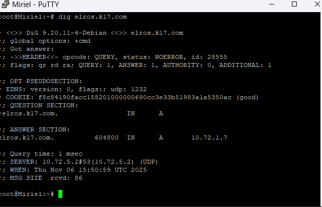
- `dig www.k17.com` menunjukkan _alias_ CNAME ke `k17.com`.
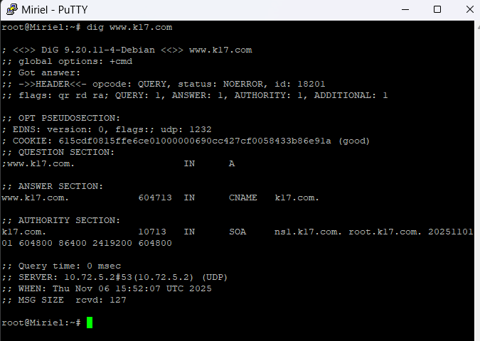
- `dig elros.k17.com TXT` berhasil menampilkan pesan rahasia `"Cincin Sauron"`.
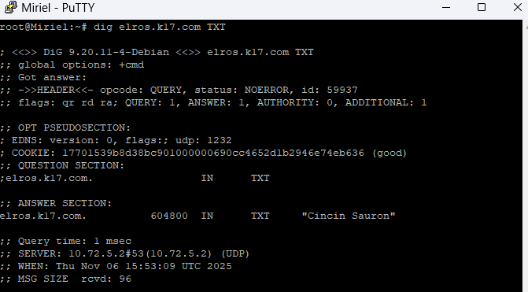
- `dig -x 10.72.2.3` berhasil me-_resolve_ ke `ns1.k17.com`.
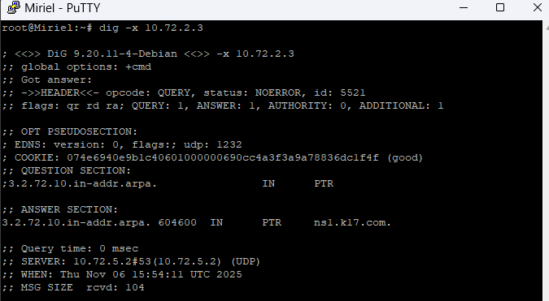

## 5. Pesan Rahasia Erendis

**Goal**: Menambahkan pesan rahasia (TXT records) ke dalam peta domain `k17.com` . Pesan "Cincin Sauron" harus menunjuk ke `Elros`, dan "Aliansi Terakhir" ke `Pharazon`. Konfigurasi ini juga harus tersalin ke `Amdir` .

### 5.1 Konfigurasi

Pengerjaan Soal 5 dieksekusi bersamaan dengan Soal 4, karena konfigurasi TXT record merupakan bagian dari file zona `k17.com` yang dikelola oleh **Erendis**.

- **Implementasi (`/etc/bind/k17.com.db`):** Konfigurasi ditambahkan pada bagian akhir file `/etc/bind/k17.com.db` di dalam skrip `soal4_5_erendis.sh`.
```
; (Secret Messages - TXT Records - Soal 5)
elros       IN      TXT     "Cincin Sauron"
pharazon    IN      TXT     "Aliansi Terakhir"
EOF
```

### 5.2 Uji Konfigurasi


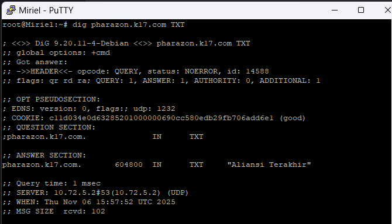

## 6. DHCP Lease Time

**Goal**: Menetapkan aturan waktu peminjaman tanah (_lease time_) untuk _client_ dinamis, sesuai dengan dekrit **Aldarion** .

## 6.1 Konfigurasi

Konfigurasi _lease time_ diimplementasikan langsung di dalam file `/etc/dhcp/dhcpd.conf` pada node **Aldarion**, yang dieksekusi oleh skrip `soal2_3_6_aldarion.sh`.

Berdasarkan skrip yang diimplementasikan, pengaturan _lease time_ kustom diterapkan secara spesifik untuk **Subnet Keluarga Manusia** (`10.72.1.0`):

- `default-lease-time` diatur ke **1800** detik (0.5 jam) .
- `max-lease-time` diatur ke **3600** detik (1 jam) .

Pengaturan untuk Keluarga Peri tidak didefinisikan secara kustom dalam skrip, sehingga akan mengikuti _lease time_ default dari `isc-dhcp-server`.

```
echo "main configuration dhcp"
cat > /etc/dhcp/dhcpd.conf << EOF
option domain-name-servers 10.72.5.2;
subnet 10.72.1.0 netmask 255.255.255.0{
        option routers 10.72.1.1;
        option broadcast-address 10.72.1.255;
        range 10.72.1.6 10.72.1.34;
        range 10.72.1.68 10.72.1.94;
        default-lease-time 1800;
        max-lease-time 3600;
}

subnet 10.72.4.0 netmask 255.255.255.0 {
        ...
        default-lease-time 600;
        max-lease-time 3600;
}
...
EOF

service isc-dhcp-server restart
```

## 7. Mengonfigurasi Laravel Worker (Soal 7-9)

**Goal**: Membangun tiga benteng pertahanan digital (`Elendil`, `Isildur`, `Anarion`) menggunakan teknologi Laravel . Ini mencakup instalasi `nginx`, `php8.4-fpm`, dan `composer` , mengkloning cetak biru dari _Resource-Laravel_ , dan menghubungkan setiap _worker_ ke _database_ **Palantir** . Setiap benteng akan mendengarkan pada _port_ unik (8001, 8002, 8003) dan aksesnya harus dibatasi hanya melalui nama domain .

### 7.1 Konfigurasi Umum Worker

Langkah-langkah berikut dijalankan pada ketiga _worker_ (`Elendil`, `Isildur`, `Anarion`).

1. **Instalasi Dependensi (Nginx, PHP 8.4, Composer):** Sesuai dengan soal , `php8.4` diinstal dengan menambahkan _repository_ PPA Sury.

```
echo "installation"
apt-get update
apt-get install -y lsb-release apt-transport-https ca-certificates wget git nginx

echo "add sury gpg key"
wget -O /etc/apt/trusted.gpg.d/php.gpg https://packages.sury.org/php/apt.gpg
echo "deb https://packages.sury.org/php/ $(lsb_release -sc) main" | tee /etc/apt/sources.list.d/php.list
apt update

echo "installation php8.4 and extensions"
apt install php8.4-fpm php8.4-mysql php8.4-mbstring php8.4-xml php8.4-cli php8.4-common php8.4-intl php8.4-opcache php8.4-readline php8.4-curl unzip wget -y

echo "install composer"
wget https://getcomposer.org/download/latest-stable/composer.phar
mv composer.phar /usr/bin/composer
chmod +x /usr/bin/composer
```

2. **Setup Proyek Laravel:** Cetak biru benteng (proyek Laravel) di-kloning dari _resource_ ke direktori `/var/www/` dan dependensi diinstal menggunakan `composer`.

```
echo "laravel project setup"
cd /var/www/
git clone https://github.com/elshiraphine/laravel-simple-rest-api.git

echo "installation laravel dependencies"
cd /var/www/laravel-simple-rest-api
composer update
composer install
```

3. **Konfigurasi Koneksi Database (`.env`):** File `.env` disalin dari `.env.example` dan dimodifikasi untuk terhubung ke _database server_ **Palantir** (`10.72.3.4`) . (Kredensial diasumsikan dari `Modul-3/Implementasi/README.md`).

```
cat > /var/www/laravel-simple-rest-api/.env << EOF
APP_NAME=Laravel
APP_ENV=local
APP_KEY=
APP_DEBUG=true
APP_URL=http://elendil.k17.com:8001

LOG_CHANNEL=stack
LOG_DEPRECATIONS_CHANNEL=null
LOG_LEVEL=debug

DB_CONNECTION=mysql
DB_HOST=10.72.3.4
DB_PORT=3306
DB_DATABASE=dbkelompokyyy
DB_USERNAME=kelompokyyy
DB_PASSWORD=passwordyyy
EOF

php artisan migrate:fresh
php artisan db:seed --class=AiringsTableSeeder
php artisan key:generate
```

### 7.2 Konfigurasi Nginx (Spesifik per Worker)

Setiap _worker_ dikonfigurasi Nginx-nya untuk mendengarkan pada _port_ unik dan memblokir akses via IP .

- **Elendil (`/etc/nginx/sites-available/elendil.k17.com`):**\

```
server {
    listen 8001;
    server_name elendil.k17.com;

    root /var/www/laravel-simple-rest-api/public;
    index index.php;

    if ($host != "elendil.k17.com") {
        return 403;
    }

    location / {
        try_files $uri $uri/ /index.php?$query_string;
    }

    location ~ \.php$ {
        include snippets/fastcgi-php.conf;
        fastcgi_pass unix:/var/run/php/php8.4-fpm.sock;
    }
}
```

- **Isildur (`/etc/nginx/sites-available/isildur.k17.com`):** Konfigurasi serupa, namun dengan:

```
listen 8002;
server_name isildur.k17.com;
if ($host != "isildur.k17.com") { return 403; }
```

- **Anarion (`/etc/nginx/sites-available/anarion.k17.com`):** Konfigurasi serupa, namun dengan:

```
listen 8003;
server_name anarion.k17.com;
if ($host != "anarion.k17.com") { return 403; }
```

### 7.3 Uji Konfigurasi

Pengujian dilakukan dari _node client_ (misal **Miriel**) untuk memverifikasi fungsionalitas .

1. **Pengujian Koneksi API (via Domain):** Perintah `curl` digunakan untuk mengakses _endpoint_ `/api/airing.

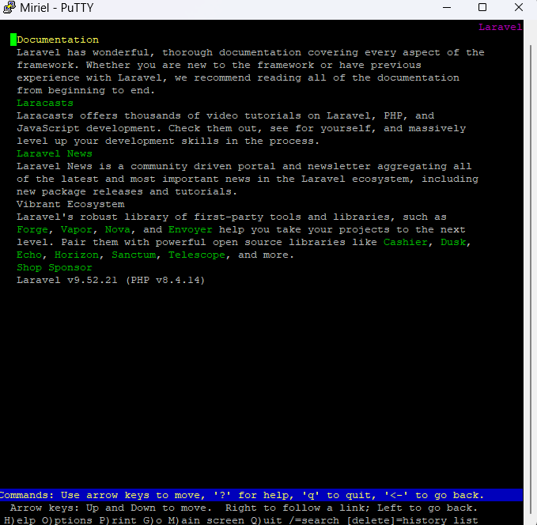

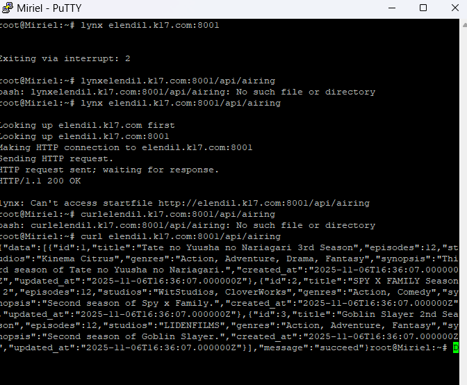

2. **Pengujian Blokir Akses IP:** Perintah `curl` digunakan untuk mengakses _worker_ menggunakan alamat IP-nya.

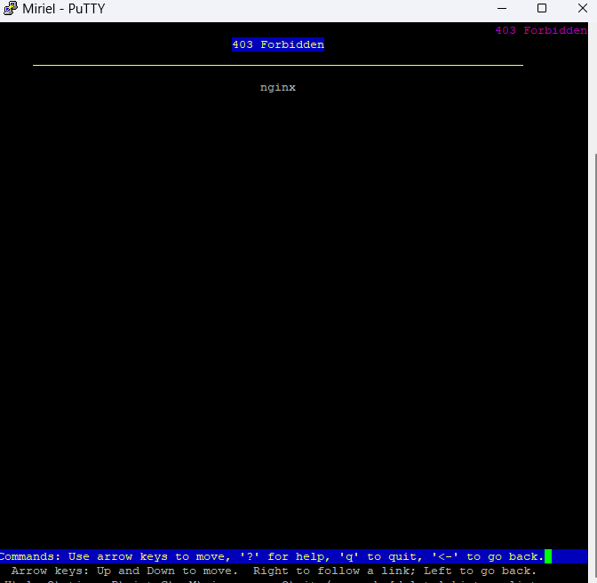


## 11. Pertahanan Numenor
**Goal**: Melakukan simulasi pengujian ketahanan sistem (load testing) menggunakan **Apache Benchmark (ab)** terhadap layanan API sederhana yang dijalankan menggunakan **Flask**, dengan dukungan **HAProxy** sebagai load balancer.

### 11.1 Konfigurasi

Pada node _client_, install **ApacheBench** dengan menjalankan perintah berikut:
```
apt update
apt install apache2-utils
```

Lalu, ubah konfigurasi file `/etc/hosts` dan tambahkan domain `elros.k17.com` mengarah ke IP server **Elros**
```
nano /etc/hosts
```
Tambahkan konfigurasi berikut:
```
10.72.1.7    elros.k17.com
```

Pada node **Elros**, instal dependensi dengan perintah berikut:
```
apt udpate
apt install python3 php8.4-fpm python3-pip -y
```
Lalu, buat program pada **Elros** untuk simulasi kerja `/api/airing` 

```
nano elros_app.py
```

Buatlah program seperti berikut:
```
from flask import Flask, jsonify
import time, random
app = Flask(__name__)

@app.route('/api/airing/')
def airing():
    t = random.uniform(0.01, 0.1)
    time.sleep(t)
    return jsonify({"status":"ok","delay":t})

if __name__=='__main__':
    app.run(host='10.72.1.7', port=80)

```
Jangan lupa untuk install dependensi `flask` sebelum menjalankan program

```
pip3 install flask
```

Lalu, program bisa dijalankan
```
python3 elros_app.py
```

Pada node **Durin**, install dependensi yang diperlukan dan atur konfigurasi

```
apt update
apt install haproxy -y
nano /etc/haproxy/haproxy.cfg
```
Tambahkan konfigurasi berikut:
```
global
    daemon
    maxconn 20000

defaults
    mode http
    timeout connect 5s
    timeout client  50s
    timeout server  50s
    option httplog

frontend http-in
    bind *:80
    default_backend elros-back

backend elros-back
    balance roundrobin
    server worker1 10.72.1.7:80 check
```
Lalu, _restart_ `haproxy` untuk menerapkan perubahan pada konfigurasi.
```
service haproxy restart
```
### 11.2 Simulasi Serangan

Kembali pada node _client_, simulasikan serangan menggunakan **ApacehBench** dengan perintah berikut:
```
echo “serangan awal” >> catatan.log && ab -n 100 -c 10 http://elros.k17.com/api/airing/ >> catatan.log
echo “serangan penuh” >> catatan.log && ab -n 2000 -c 100 http://elros.k17.com/api/airing/ >> catatan.log
```

## 12. PHP Web Server

**Goal**: Menjalankan PHP 8.4-FPM
dan mebatasi akses hanya melalui nama domain, bukan alamat IP

### 12.1 Konfigurasi

Pada tiap node _worker_, instal dependensi berikut:
```
apt update
apt install nginx php8.4-fpm -y
service nginx start
service php8.4-fpm
nano /var/www/html/index.php
```
Tambahkan baris berikut pada file:
```
<?php
echo "<h1>Welcome to " . gethostname() . "</h1>";
?>
```
Lalu pada file `/etc/nginx/sites-available/default`, tambahkan juga konfigurasi nginx berikut:
```
server {
    listen 80;
    server_name galadriel.k17.com; #sesuaikan utk tiap node

    root /var/www/html;
    index index.php index.html;

    location / {
        try_files $uri $uri/ =404;
    }

    location ~ \.php$ {
        include snippets/fastcgi-php.conf;
        fastcgi_pass unix:/run/php/php8.4-fpm.sock;
    }

    if ($host ~* "^\d+\.\d+\.\d+\.\d+$") {
        return 403;
    }
}
```
Terapkan perubahan konfigurasi dengan perintah berikut:
```
nginx -t
service nginx restart
```

tambahkan domain pada file `/etc/hosts` sebagai berikut:
```
10.72.4.7    galadriel.k17.com
10.72.4.6    celeborn.k17.com
10.72.4.5    oropher.k17.com
```
### 12.2 Uji Konfigurasi

Ketika kita menjalankan perintah `curl http://oropher.k17.com`. Akan didapatkan respon sebagai berikut:


dan untuk perintah `curl http://10.73.4.5` akan didapatkan respon sebagai berikut:


## 13. Nginx Custom Listen Port

**Goal**: Atur agar **Galadriel** mendengarkan di port 8004, **Celeborn** di 8005, dan **Oropher** di 8006.

### 13.1 Konfigurasi

Pada tiap node, tambahkan konfigurasi berikut pada file `/etc/nginx/sites-avaiable/default`
```
server {
    listen 8004; # Sesuaikan port berikut sesuai soal
    # konfigurasi lain
}
```
Terapkan perubahan pada konfigurasi
```
nginx -t
service nginx restart
```

### 13.2 Uji Konfigurasi
Uji konfigurasi dengan melakuakn perintah `curl http://oropher.k17.com` dan respon yang didapatkan seharusnya server tidak terkoneksi.

Gunakan perintah `curl http://oropher.k17.com:8006` untuk mendapatkan _return_ berupa isi dari `index.php`.

## 14. Basic Authentication

**Goal**: Terapkan _basic authentication_ pada konfigurasi nginx

### 14.1 Konfigurasi

Install `apache2-utils` untuk menggunakan `htpasswd` yang akan kita gunakan dalam konfigurasi `nginx`
```
apt update
apt install apache2-utils -y
```

Lalu, buat file autentikasi dengan perintah berikut untuk username sebagai `noldor`:
```
htpasswd -c -B /etc/nginx/.htpasswd noldor
```
Gunakan password `silvan` seperti instruksi pada soal.

Kemudian, ubah akese file dengan perintah berikut:
```
chown root:root /etc/nginx/.htpasswd
chmod 640 /etc/nginx/.htpasswd
```

Pada konfigurasi nginx, tambahkan pengaturan berikut di dalam `server { }` yang ada:
```
auth_basic "Restricted";
auth_basic_user_file /etc/nginx/.htpasswd;
```
Terapkan perubahan pada konfigurasi:
```
nginx -t
service nginx restart
```

### 14.2 Uji Akses
Jika kita menjalankan perintah ```curl http://oropher.k17.com```, akan didapatkan *Unauthorized prompt* seperti berikut:

Lakukan curl dengan parameter kredensial seperti berikut:
```
curl -u noldor:silvan http://oropher.k17.com
```

## 15. IP Client
**Goal**: Menampilkan alamat IP pengunjung asli pada index.php

Tambahkan konfigurasi berikut pada file nginx bagian `location ~\.php$`
```
fastcgi_param X-Real-IP $remote_addr;
fastcgi_param X-Forwarded-For $proxy_addr;
```

Terapkan perubahan pada konfigurasi:
```
nginx -t
service nginx restart
```

Ubah file `/var/www/html/index.php` menjadi seperti ini:
```
<?php
$hostname = gethostname();
$ip = $_SERVER['HTTP_X_REAL_IP'] ?? $_SERVER['REMOTE_ADDR'];
echo "<h1>Welcome to $hostname</h1>";
echo "<p>Your IP address: <strong>$ip</strong></p>";
?>
```